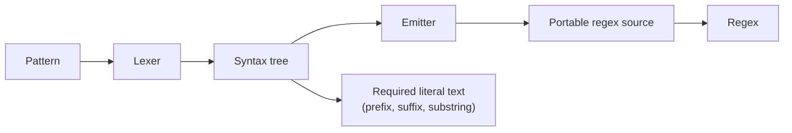
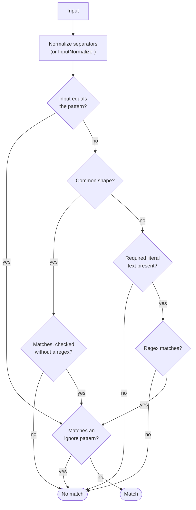

# Snowberry.Globbing

[](https://github.com/snowberry-software/Snowberry.Globbing/blob/main/LICENSE)
[](https://www.nuget.org/packages/Snowberry.Globbing/)

**Accurate glob pattern matching for .NET.** Match paths and strings against glob patterns with wildcards, globstars, brace expansion, extended globs and POSIX character classes, with the matching semantics of the JavaScript library [picomatch](https://github.com/micromatch/picomatch). Patterns compile to a regex that behaves identically in .NET, JavaScript and PostgreSQL 17+, so the same glob can filter files in memory, in a browser and in a database query.

Targets .NET 10 and .NET Standard 2.0. The .NET 10 build has no dependencies; the .NET Standard 2.0 build depends only on [System.Memory](https://www.nuget.org/packages/System.Memory/).

## Table of Contents

- [Installation](#installation)
- [Quick Start](#quick-start)
- [Top Features at a Glance](#top-features-at-a-glance)
- [How It Works](#how-it-works)
- [Pattern Syntax](#pattern-syntax)
- [Options](#options)
- [Using the Regex in JavaScript and PostgreSQL](#using-the-regex-in-javascript-and-postgresql)
- [Error Handling](#error-handling)
- [Performance](#performance)
- [Pitfalls](#pitfalls)

## Installation

```bash
dotnet add package Snowberry.Globbing
```

## Quick Start

```csharp
using Snowberry.Globbing;

// 1. One-off check: the static IsMatch caches compiled single patterns.
bool isSource = Glob.IsMatch("src/lib/app.cs", "src/**/*.cs"); // true

// 2. Compile once, match many: Glob is immutable and thread-safe.
var glob = new Glob("**/*.{cs,csproj}", new GlobOptions { IgnorePatterns = ["**/bin/**", "**/obj/**"] });

glob.IsMatch("src/App/App.csproj");        // true
glob.IsMatch("src/App/bin/Debug/App.cs");  // false (ignored)

// 3. Filter a sequence; results keep the input order.
string[] files = ["README.md", "src/Program.cs", "src/obj/Generated.cs"];
var sources = glob.Filter(files);          // ["src/Program.cs"]

// 4. Get the regex for other engines.
string regex = new Glob("src/**/*.cs").ToRegexString();
```

## Top Features at a Glance

- **One reusable type.** `Glob` compiles a pattern, or several patterns of which any may match, once. It offers `IsMatch(string)`, `IsMatch(ReadOnlySpan<char>)`, `Match`, `Filter`, `ToRegex` and `ToRegexString`.
- **Immutable options.** `GlobOptions` is a record: share one instance across threads and derive variants with `with`. `IgnorePatterns` is copied when set, so later changes to your list do not leak into the options.

  ```csharp
  var options = GlobOptions.Default with { IgnoreCase = true, MatchDotFiles = true };
  ```

- **Match details.** `Match` reports whether an input was excluded by an ignore pattern and which pattern matched first.

  ```csharp
  GlobMatch result = glob.Match("src/obj/Generated.cs");
  // result.Success == false, result.IsIgnored == true, result.Pattern == "**/*.{cs,csproj}"
  ```

- **Portable regex.** `ToRegexString()` returns one regex source for .NET, JavaScript and PostgreSQL, verified against picomatch by a cross-engine conformance suite.
- **Pattern analysis.** `Glob.Analyze` splits a pattern into its literal base directory and its glob part, which is what a directory walker needs.

  ```csharp
  GlobInfo info = Glob.Analyze("src/lib/**/*.cs");
  // info.BasePath == "src/lib", info.GlobPart == "**/*.cs", info.HasGlobstar == true
  ```

- **Fast matching.** Literal text a pattern requires, such as the `.js` of `**/*.js`, is checked with ordinal string comparisons before the regex runs, so most non-matching inputs never reach the regex engine. Matching with an existing `Glob` does not allocate on .NET 10 unless `InputNormalizer` is set.

## How It Works

A pattern is compiled once, when the `Glob` is created:



Matching then normalizes each input and runs the cheapest checks first:



With several patterns, the checks before the ignore patterns run for each pattern in order, and the first one that matches wins. When a glob has many patterns, an index of required three-character substrings skips the patterns an input cannot match.

Common shapes such as `*.js`, `**/*.cs`, `src/**` and plain names are matched with string operations, without running a regex. Most chains of wildcards, such as `*a*b*c`, compile to regexes that do not backtrack between the wildcards. A negated pattern such as `!**/node_modules/**` is matched by running the regex of its body and inverting the result, which lets the literal check skip most inputs there too. Only the regex source is public through `ToRegexString()`; the other steps are applied by `Glob` itself.

## Pattern Syntax

| Syntax | Matches |
| --- | --- |
| `*` | Any characters in one path segment, except `/` |
| `?` | One character, except `/` |
| `**` | Any number of path segments |
| `[abc]`, `[a-z]`, `[!a]` | One character from, or not from, the set |
| `[[:alpha:]]`, `[[:digit:]]` | A POSIX character class |
| `{a,b}` | Any of the alternatives |
| `{1..5}`, `{01..10}`, `{1..9..2}`, `{a..e}` | A numeric range, zero-padded or stepped, or a character range |
| `!pattern` | Anything that does not match `pattern` |
| `@(a\|b)` | Exactly one of the alternatives |
| `?(a\|b)`, `*(a\|b)`, `+(a\|b)` | Zero or one, zero or more, one or more of the alternatives |
| `!(a\|b)` | Anything except the alternatives |
| `\*` | A literal `*` (any character can be escaped) |

Wildcards do not match a leading `.` in a segment unless `MatchDotFiles` is set. An input that is exactly equal to the pattern always matches.

## Options

| Option | Default | Description |
| --- | --- | --- |
| `IgnoreCase` | `false` | Match case-insensitively, using culture-invariant rules |
| `MatchDotFiles` | `false` | Let wildcards match segments starting with `.` |
| `MatchFileNameOnly` | `false` | Match only the file name of the input, ignoring directories |
| `MatchSubstring` | `false` | Match anywhere in the input instead of the whole input |
| `PathStyle` | `Auto` | `Posix`: only `/` separates, `\` in inputs is an ordinary character; `Windows`: `\` in inputs is converted to `/`; `Auto`: like `Posix`, but converts `\` in inputs when running on Windows |
| `IgnorePatterns` | empty | Patterns that exclude otherwise matching inputs; compiled with the same options |
| `BraceExpansion` | `true` | Expand `{a,b}` and `{1..5}` |
| `BracketExpressions` | `true` | Support `[abc]` |
| `Extglobs` | `true` | Support `@(...)`, `!(...)` and the other extended globs |
| `Globstar` | `true` | Let `**` cross directories |
| `Negation` | `true` | Treat a leading `!` as negation |
| `PosixClasses` | `true` | Expand `[[:alpha:]]` and the other POSIX classes |
| `StrictSlashes` | `false` | Do not let trailing wildcards also match a trailing `/` |
| `StrictBrackets` | `false` | Throw on unbalanced `[`, `(` and `{` instead of matching them literally |
| `RegexOptions` | `None` | Extra options for the regex used for matching and returned by `ToRegex()`, for example `RegexOptions.Compiled`; `NonBacktracking` is not supported |
| `MatchTimeout` | `null` | Time limit for each regex evaluation; `null` uses the process-wide `REGEX_DEFAULT_MATCH_TIMEOUT`, `Regex.InfiniteMatchTimeout` disables it |
| `MaxPatternLength` | `65536` | Longest accepted pattern |
| `InputNormalizer` | `null` | Transforms each input before matching, replacing the separator conversion of `PathStyle` |

Rarely needed compatibility switches: `BracketMode`, `BashCompatibility`, `RegexQuantifiers`, `KeepQuotes`, `Unescape`, `CaptureGroups` and `BraceRangeExpander`. See their XML documentation.

## Using the Regex in JavaScript and PostgreSQL

`ToRegexString()` returns one regex source that matches the same inputs in .NET, JavaScript and PostgreSQL 17+, including inputs with line breaks. Use it without flags in JavaScript:

```js
const isSource = new RegExp(source).test("src/lib/app.cs");
```

With Npgsql or EF Core, pass `RegexOptions.Singleline`. Without it, Npgsql adds PostgreSQL's `(?p)` flag, which stops `*` and `?` from matching line breaks:

```csharp
string source = new Glob("src/**/*.cs").ToRegexString();
var files = await db.Files.Where(f => Regex.IsMatch(f.Path, source, RegexOptions.Singleline)).ToListAsync();
```

The regex covers the patterns only. `Glob` applies the rest itself: `IgnoreCase` (use `RegexOptions.IgnoreCase`, `~*` in PostgreSQL or the `i` flag in JavaScript), `RegexOptions`, `MatchTimeout`, `IgnorePatterns`, `MatchFileNameOnly`, input normalization and the input-equals-pattern rule.

## Error Handling

| Situation | Exception |
| --- | --- |
| `null` pattern, pattern list or input | `ArgumentNullException` |
| An empty pattern list | `ArgumentException` |
| Any invalid pattern or ignore pattern | `GlobParseException`, with an `Error` code |
| A regex evaluation exceeds `MatchTimeout`, or the process-wide default when it is `null` | `RegexMatchTimeoutException` |

| `Error` | Cause |
| --- | --- |
| `EmptyPattern` | The pattern, a pattern in the list or an ignore pattern is `null` or empty |
| `PatternTooLong` | The pattern is longer than `MaxPatternLength` |
| `MissingClosingBracket`, `MissingOpeningBracket`, `MissingClosingParenthesis`, `MissingOpeningParenthesis`, `MissingClosingBrace` | An unbalanced delimiter, with `StrictBrackets` |
| `NestingTooDeep` | Groups, braces or extended globs nested more than 256 levels deep |
| `InvalidPattern` | The pattern is not a valid regex, such as `[z-a]`, or `RegexOptions` is an invalid combination or unsupported, such as `NonBacktracking` |

`GlobParseException` derives from `ArgumentException` and carries the `Pattern`, the `Error` code and the `Offset`; its `ParamName` names the argument the pattern came from (`pattern`, `patterns` or `IgnorePatterns`). Use `Glob.TryCreate` to validate user-supplied patterns without exceptions. Its `error` reports every failure, including a `null` pattern, as a `GlobParseException`, so you can switch on the code:

```csharp
if (!Glob.TryCreate(userPattern, options, out var glob, out var error))
{
    return error.Error switch
    {
        GlobParseError.EmptyPattern => Results.BadRequest("Enter a pattern."),
        GlobParseError.PatternTooLong => Results.BadRequest("The pattern is too long."),
        _ => Results.BadRequest($"Invalid pattern at position {error.Offset}: {error.Message}"),
    };
}
```

## Performance

- **Reuse `Glob` instances.** Construction parses and compiles the pattern; matching does not. The static `Glob.IsMatch(input, pattern)` caches compiled patterns, but a long-lived instance is cheaper still.
- **The pattern-list overload is not cached.** `Glob.IsMatch(input, patterns)` compiles all patterns on every call; create a `Glob` from the list instead.
- **Interpreted regex by default.** `RegexOptions.Compiled` pays a large one-time IL-generation cost (hundreds of microseconds to milliseconds per pattern). Set `RegexOptions = RegexOptions.Compiled` only for a glob reused across tens of thousands of inputs or more.
- **A match timeout has a small cost.** With `MatchTimeout` set, the regex engine checks the clock while matching, which made matching up to about 20% slower in benchmarks. The default `null` adds nothing.
- **Many patterns.** A glob with dozens to thousands of patterns, such as a `.gitignore`, is indexed when it is created, which makes matching 4 to 30 times faster at 50 to 1,000 patterns and construction up to about 1.4 times slower.
- **No allocations.** On .NET 10, `IsMatch` allocates nothing, including with ignore patterns, file-name matching and Windows separators, unless `InputNormalizer` is set. On .NET Framework, the `ReadOnlySpan<char>` overload avoids a string only when every pattern has a common shape.

## Pitfalls

- **`Auto` path style depends on the platform.** On Windows, `src\app.cs` matches `src/*.cs`; on Linux it does not. Set `PathStyle = GlobPathStyle.Posix` or `Windows` when results must not depend on the OS.
- **A backslash in a pattern is always an escape.** Write patterns with `/`, even for Windows paths; `src\*.cs` means `src*.cs` with a literal `*`.
- **Npgsql needs `RegexOptions.Singleline`.** Without it, inputs that contain line breaks match differently in PostgreSQL than in .NET.
- **`ToRegexString()` does not encode every option.** Ignore patterns, file-name matching, case-insensitivity, `RegexOptions` and `MatchTimeout` are not part of the regex text; apply them on the consuming side. Regex syntax you write into a pattern, such as `\d`, and `BraceRangeExpander` output are copied as-is and are only portable if they are portable themselves.
- **Untrusted patterns need a `MatchTimeout`.** Most chains of wildcards do not backtrack, but repeated extended globs with overlapping alternatives backtrack exponentially: `+(a|aa)b` takes about 5 seconds on a 40-character input, and each extra character makes it about 1.6 times slower. When users supply patterns, set `MatchTimeout` and handle `RegexMatchTimeoutException`. The limit applies per regex evaluation, so a glob with several patterns or ignore patterns can take a multiple of it.
- **`RegexOptions.NonBacktracking` is not supported.** The generated regexes use lookarounds, which the non-backtracking engine rejects, so nearly every pattern fails with `InvalidPattern`. Use `MatchTimeout` to bound matching time instead.
- **Some characters are not portable.** PostgreSQL counts a character outside the Basic Multilingual Plane, such as an emoji, as one character, while .NET and JavaScript count two, so `?` and the boundaries of `*` differ for such input. With `IgnoreCase`, a few characters fold differently: .NET 10 folds the Kelvin sign (U+212A) to `k` and .NET Framework and JavaScript do not, and PostgreSQL folds the long s (U+017F) to `s` and .NET and JavaScript do not. An escaped ASCII letter, such as `\a`, is regex syntax and means different things in each engine.
- **Negated patterns never match line breaks.** `!*.md` does not match an input that contains `\n`, `\r` or a Unicode line separator.
- **Unbalanced delimiters are literal.** `a{b` matches the text `a{b`. Set `StrictBrackets` to reject such patterns instead.
- **Large ranges match literally.** A numeric range with more than 4,096 values, such as `{1..100000}`, is not expanded and matches only its own text.
